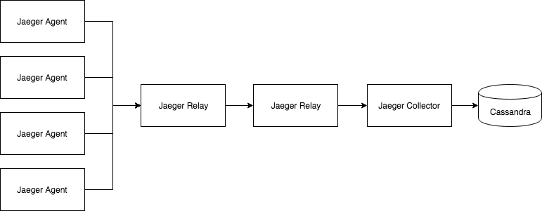

# Jaeger Relay Component

The `Jaeger Relay` is a component that receives spans from an upstream
tracing component (e.g. jaeger agent) and relays those spans to downstream tracing
component(s) (e.g. jaeger collector or the jaeger relay). The relay supports
receiving and exporting spans in a number of protocols, multi-destination
support, and per-destination in-memory buffering with retry. This component enables
ingestion pipeline configurations for several use-cases.

The relay provides several features:
- Support for incoming data in a number of protocols, currently:
  - Zipkin (Thrift encoding over HTTP)
  - Jaeger (Thrift encoding over HTTP)
  - Jaeger (Thrift encoding over tChannel)
- Support for exporting data over a number of protocols, currently:
  - Jaeger (Thrift encoding over HTTP)
  - Jaeger (Thrift encoding over tChannel)
- Support for exporting to multiple destinations, with separate in-memory bounded
  buffer per destination. Option to retry in case of failure to export (e.g. remote
  endpoint unavailable), with configurable back-off delay
- Detailed telemetry including metrics for each stage in the pipeline (E.g. exposed via
  prometheus endpoint)
- Many configuration options to build a custom data pipeline with desired behaviors

## Example Use Cases
Below we show a few use cases possible. The module itself
is quite flexible and configuration options allow for many more
flexible data pipelines to be configured.

### Use Case 1 : Agents -> Relay -> Collector


### Use Case 2 : Zipkin Tasks -> Relay -> Collector
The relay is capable of receiving spans in zipkin format, thus
pretending to be `Zipkin collector` and internally adapting to
Jaeger format before sending out to the Jaeger collector.  



### Use Case 3 : Agents -> Relay -> Relay -> Collector


### Use Case 4 : Agents -> Relay -> Multiple Endpoints


## Configuration
The relay reads in configuration from a file, and the relay
container looks for a file named `/conf/relay.yaml`. Here is
a sample configuration file:  

```
# this section captures settings for receiving data
receiver:

  # port at which jaeger spans (thrift encoding) are received over tchannel
  # defaults to 14267
  jaeger-tchannel-port: 14267

  # port at which jaeger spans (thrift encoding) are received over http
  # defaults to 14268
  jaeger-http-port: 14268

  # port at which zipkin spans (thrift encoding) are received over http
  # defaults to 9411
  zipkin-http-port: 9411

# this section captures the setting for each named "processor" that buffers
# data in an in-memory bounded buffer, and has several workers sending them
# out concurrently
processors:

  # this is an example processor named "prod"
  prod:

    # number of workers, defaults to 10
    num-workers: 10

    # maximum allowed size (in number of batches) of bounded in-memory queue
    # defaults to 1000 batches
    # size of each batch can vary and depends upon a number of factors like
    # sampling strategy, flush frequency in clients, and request throughput.
    # future work may change this to bytes than batches.
    queue-size: 1000

    # configures the retry policy in case of failure to send to target.
    # default is to keep retrying forever, thus failure to send causes batch
    # to be put back into the queue. alternative is to discard batch in
    # case of send failure.
    retry-on-failure: true

    # configures the amount of time, after a failure to send out a span batch,
    # to wait before trying to send the next span batch. default is 5s.
    backoff-delay: 5s

    # type of sender (encoding, transport) to use to send spans to remote target
    sender-type: thrift-http

    # sender-specific settings (key should be same as sender-type value)
    # the thrift-http sender offers the following settings:
    # collector-endpoint: url that receives the spans in jaeger format (thrift over http)
    # headers: custom HTTP headers to send with each request, empty default
    # timeout: timeout used by underlying net.http.Client, defaults to 5s
    thrift-http:
      collector-endpoint: https://api.prod.fake-company.com/api/traces
      headers: { "hello":"world", "host":"api.prod.fake-company.com" }
      timeout: 5s

  stag:
    num-workers: 10
    queue-size: 1000
    retry-on-failure: true
    sender-type: thrift-tchannel

    # the thrift-tchannel sender offers the following settings:
    # collector-host-ports: array of host:port of Jaeger Collectors to send to
    # discovery-min-peers: the min number of servers we want the agent to connect to.
    #        defaults to min(3, number of peers returned by service discovery)
    # discovery-conn-check-timeout: the timeout used when establishing new connections
    #        defaults to 250ms
    thrift-tchannel:
      collector-host-ports: [ "jaeger-collector1:14267", "jaeger-collector2:14267", "jaeger-collector3.14267" ]
      discovery-min-peers: 3
      discovery-conn-check-timeout: 250ms
```

## Monitoring

The component is instrumented with detailed metrics for each stage of the data
pipeline. Metrics are exposed in prometheus format at the `/metrics` endpoint
on the same port as `jaeger-http-port` configured in `receiver` section
(defaults to `14268` and so default metrics endpoint is
[http://localhost:14268/metrics](http://localhost:14268/metrics)).

There is a shared Grafana dashboard available [here](https://grafana.com/dashboards/8118)
to help you get started.

## Design

The most important concept in the relay's software design is the
[SpanProcessor interface](https://github.com/jaegertracing/jaeger/blob/01ff822b114ff1e583283970daab19fe77fd47e7/cmd/collector/app/span_handler.go#L51).
This plugs into existing components like the TChannel and HTTP servers that
receive jaeger and zipkin formatted spans. The existing `spanProcessor` implementation
from collector could not be used because it uses the `spanStore.Writer` interface
which requires writing out one span at a time, whereas for many reasons it is better
to preserve the span batch as it originally arrived at the relay for passing down
to the sender.

Here is a class diagram that describes the `SpanProcessor` implementations in relay:


## Roadmap

There are many features that can be added into the relay:
- Support receive and export in the proto model over grpc
- Support for per export target filtering
- Support other exporters (e.g. S3, Kinesis, etc.)
- Support for mutual TLS with remote destination

